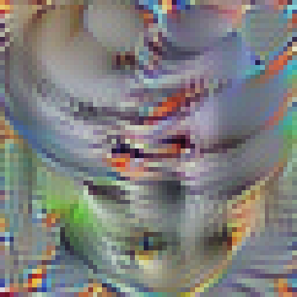

# AIPI__AdversarialPatch

This project seeks to make an effective adversarial patch for the ImageNet classifier. To do this we generate a feature map for a specific class activation and, in doing so, give us a 'patch' that can be overlaid or physically appended to objects in order to alter the way ImageNet classifies them. 

In this case, I utilized the ImageNet class: Missile. I thought this was particularly interesting because I spent my summer internship working with the U.S. Navy regarding Naval Vessel Point Defense Systems. While current point defense systems infrequently (if ever) utlize image classifiers and often rely on radar or EO/IR sensors, it is not hard to envision a future where these are used. This potential future coupled with current events in the Red Sea highlights a potential for drone employment where, should a defensive system ever employ an image classifier, an drone with this patch might be incorrectly classified to stimulate the defensive aparatus. This is a form of easy deception that should be well understood if image classifiers are going to be employed in this way.

Here is the missile patch:

Of note, the resolution of the patch and the size of the patch are all important for its use in an adversarial way. Depending on how close, or how much of an image is taken up by the patch, the desired inaccuracy of ImageNet varies. I think the viability of these patches for the use case described above is currently dubious at best but it still highlights the potential vulnerabilities of attractive AI augments to critical procedures.